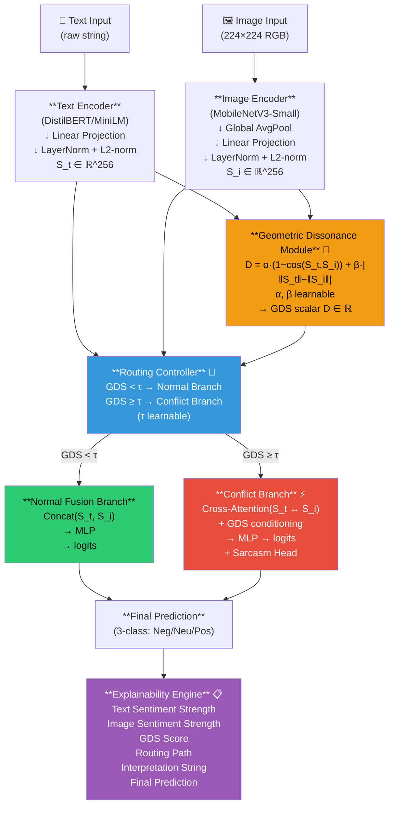

# CGRN Architecture Diagram

## Component Descriptions

| Component | Role | Patent Novelty |
|---|---|---|
| **Text Encoder** | DistilBERT backbone → normalized sentiment vector S_t | Independent modality encoding |
| **Image Encoder** | MobileNetV3 backbone → normalized sentiment vector S_i | Lightweight visual sentiment |
| **GDS Module** | Computes geometric dissonance D from S_t, S_i | **Core novel contribution** |
| **Routing Controller** | Dispatches to specialized branch based on D vs. τ | **Novel conflict-aware routing** |
| **Normal Fusion Branch** | Concat + MLP for harmonious samples | Standard path |
| **Conflict Branch** | Cross-attention refinement + sarcasm head for high-GDS samples | **Novel conflict resolution** |
| **Explainability Engine** | Auto-generates structured conflict reports | **Novel interpretability method** |